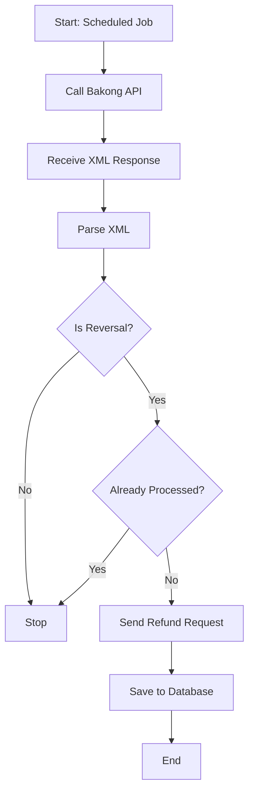

# 🏦 Bakong Automation System

An automated transaction reversal bot for the Bakong payment system by the National Bank of Cambodia (NBC). This system monitors incoming transactions, detects reversal requests, and automatically processes refunds while preventing duplicate processing.

## 📋 Table of Contents

- [Overview](#overview)
- [Features](#features)
- [Tech Stack](#tech-stack)
- [Prerequisites](#prerequisites)
- [Installation](#installation)
- [Configuration](#configuration)
- [Project Structure](#project-structure)
- [Usage](#usage)
- [Testing](#testing)
- [How It Works](#how-it-works)
- [API Documentation](#api-documentation)
- [Troubleshooting](#troubleshooting)

## 🎯 Overview

This system automates the process of handling transaction reversals from the Bakong payment gateway. When NBC sends a reversal request (refund), the bot:

1. **Fetches** incoming transactions via SOAP API
2. **Parses** XML to extract transaction details
3. **Validates** that the transaction hasn't been processed before
4. **Executes** the refund automatically
5. **Records** the transaction in PostgreSQL to prevent duplicates

## ✨ Features

- ✅ **Automatic Reversal Detection** - Parses XML to identify reversal transactions
- ✅ **Duplicate Prevention** - Database tracking prevents processing the same reversal twice
- ✅ **SOAP Integration** - Full SOAP client for Bakong API communication
- ✅ **Mock Server** - Built-in mock Bakong server for local testing
- ✅ **PostgreSQL Storage** - Reliable transaction logging
- ✅ **TypeScript** - Full type safety and modern development experience
- ✅ **Environment-Based Config** - Separate development and production configurations

## 🛠️ Tech Stack

| Technology          | Purpose                   |
| ------------------- | ------------------------- |
| **Node.js**         | Runtime environment       |
| **TypeScript**      | Type-safe development     |
| **Express**         | HTTP server framework     |
| **PostgreSQL**      | Transaction database      |
| **Axios**           | HTTP/SOAP requests        |
| **fast-xml-parser** | XML parsing               |
| **node-cron**       | Scheduled automation      |
| **dotenv**          | Environment configuration |

## 📦 Prerequisites

Before you begin, ensure you have installed:

- **Node.js** (v18 or higher)
- **PostgreSQL** (v14 or higher)
- **npm** or **yarn**

## 🚀 Installation

### 1. Clone the Repository

```bash
git clone <repository-url>
cd bakong-automation
```

### 2. Install Dependencies

```bash
npm install
```

### 3. Set Up Database

Create a PostgreSQL database:

```sql
CREATE DATABASE nbc_intergration_db;
```

Create the transactions table:

```sql
CREATE TABLE transaction_logs (
    id SERIAL PRIMARY KEY,
    trx_hash VARCHAR(255) UNIQUE NOT NULL,
    amount DECIMAL(15, 2) NOT NULL,
    currency VARCHAR(10) NOT NULL,
    status VARCHAR(50) NOT NULL,
    created_at TIMESTAMP DEFAULT CURRENT_TIMESTAMP
);
```

### 4. Configure Environment

Copy the example environment file and fill in your credentials:

```bash
cp .env.example .env.development
```

Edit `.env.development` with your real values (see [Configuration](#configuration) below). Do not commit `.env.development` (it contains secrets).

## ⚙️ Configuration

Edit your `.env.development` file:

```env
# Database Credentials
DB_HOST=localhost
DB_PORT=5432
DB_USER=your_db_user
DB_PASSWORD=your_db_password
DB_NAME=nbc_intergration_db

# Server Configuration
PORT=3000

# Bakong API Configuration
BAKONG_API_URL=http://localhost:3000/mock-bakong  # For testing
BAKONG_USERNAME=your_bakong_username
BAKONG_PASSWORD=your_bakong_password
BAKONG_API_KEY=your_api_key
BAKONG_API_SECRET=your_api_secret

# Other Configuration
NODE_ENV=development
```

### Production Configuration

For production, create `.env.production` and update:

```env
BAKONG_API_URL=https://api.bakong.nbc.org.kh/service  # Real Bakong endpoint
BAKONG_USERNAME=<real_username>
BAKONG_PASSWORD=<real_password>
```

## 📁 Project Structure

```
bakong-automation/
├── src/
│   ├── config/              # Configuration files
│   │   └── db.ts            # PostgreSQL connection pool
│   ├── controllers/         # Request handlers
│   │   └── mock.controller.ts   # Mock Bakong server
│   ├── models/              # Database models
│   │   └── transaction.model.ts # Transaction CRUD operations
│   ├── services/            # Business logic
│   │   ├── bakong.service.ts    # Bakong API client
│   │   └── reversal.service.ts  # Main reversal logic
│   ├── utils/               # Utility functions
│   │   ├── soap-client.ts       # SOAP HTTP client
│   │   └── xml-parser.ts        # XML parsing logic
│   ├── tests/               # Test files
│   │   ├── test-xml-parser.ts   # XML parser tests
│   │   └── test-full-flow.ts    # End-to-end tests
│   ├── jobs/                # Scheduled tasks (future)
│   ├── types/               # TypeScript type definitions
│   └── server.ts            # Express server entry point
├── .env.development         # Development environment variables
├── package.json             # Dependencies and scripts
├── tsconfig.json            # TypeScript configuration
└── README.md                # This file
```

## 🎮 Usage

### Development Mode

Start the development server with auto-reload:

```bash
npm run dev
```

The server will start on `http://localhost:3000` with the mock Bakong endpoint available.

### Health Check

Once the server is running, you can check DB connectivity:

```bash
curl http://localhost:3000/health
```

Returns `200` with `{ "status": "ok", "db": "connected" }` when the database is reachable, or `503` when it is not.

### Production Mode

1. Build the TypeScript code:

```bash
npm run build
```

2. Start the production server:

```bash
npm start
```

### Run Tests

Run the XML parser test (same as `npm test`):

```bash
npm test
```

Or explicitly:

```bash
npm run test:parser
```

Test the full flow (requires server running in another terminal):

**Terminal 1** - Start server:

```bash
npm run dev
```

**Terminal 2** - Run tests:

```bash
npx ts-node src/tests/test-full-flow.ts
```

## 🧪 Testing

### Local Testing with Mock Server

The project includes a mock Bakong server for testing without hitting the real API:

1. The mock server responds at `POST /mock-bakong`
2. Returns a fake reversal transaction XML
3. Perfect for testing the full automation flow

### Test Scenarios

The full-flow test demonstrates:

- ✅ **First Run**: Successfully processes a reversal
- ✅ **Second Run**: Detects duplicate and blocks processing
- ✅ **Database Integration**: Verifies transaction logging

## 🔄 How It Works

### Step-by-Step Flow



### 1. **Fetch Transactions**

```typescript
const rawXml = await BakongService.getIncomingTransactions();
```

Sends a SOAP request to Bakong API to retrieve pending transactions.

### 2. **Parse XML**

```typescript
const data = parseBakongXML(rawXml);
```

Extracts key information:

- Transaction hash
- Amount & currency
- Reversal flag
- End-to-end ID

### 3. **Check for Duplicates**

```typescript
const exists = await TransactionModel.exists(data.trxHash);
if (exists) return; // 🛑 Stop processing
```

Prevents infinite loops by checking if we've already processed this reversal.

### 4. **Execute Refund**

```typescript
await BakongService.makeFullFundTransfer(
  data.amount,
  data.currency,
  data.trxHash,
);
```

Sends the money back to the sender via Bakong's `makeFullFundTransfer` endpoint.

### 5. **Record Transaction**

```typescript
await TransactionModel.create(
  data.trxHash,
  data.amount,
  data.currency,
  "SUCCESS",
);
```

Saves the transaction to PostgreSQL for future duplicate checks.

## 📡 API Documentation

### Bakong Service Methods

#### `getIncomingTransactions()`

Fetches the list of incoming transactions from Bakong.

**Returns:** `Promise<string>` - Raw XML response

**SOAP Request:**

```xml
<soapenv:Envelope xmlns:soapenv="http://schemas.xmlsoap.org/soap/envelope/">
  <soapenv:Body>
    <ser:getIncomingTransaction>
      <arg0>username</arg0>
      <arg1>password</arg1>
    </ser:getIncomingTransaction>
  </soapenv:Body>
</soapenv:Envelope>
```

#### `makeFullFundTransfer(amount, currency, originalHash)`

Sends a refund for a specific transaction.

**Parameters:**

- `amount` (number) - Amount to refund
- `currency` (string) - Currency code (e.g., "KHR", "USD")
- `originalHash` (string) - Original transaction hash

**Returns:** `Promise<string>` - Response from Bakong

### Database Model Methods

#### `TransactionModel.exists(hash)`

Checks if a transaction hash already exists in the database.

**Parameters:**

- `hash` (string) - Transaction hash to check

**Returns:** `Promise<boolean>`

#### `TransactionModel.create(hash, amount, currency, status)`

Records a new transaction in the database.

**Parameters:**

- `hash` (string) - Unique transaction hash
- `amount` (number) - Transaction amount
- `currency` (string) - Currency code
- `status` (string) - Transaction status (e.g., "SUCCESS")

**Returns:** `Promise<Transaction>`

## 🐛 Troubleshooting

### Common Issues

#### 1. **"Invalid URL" Error**

**Problem:** `process.env.BAKONG_API_URL` is undefined

**Solution:**

- Copy `.env.example` to `.env.development` if you don't have one: `cp .env.example .env.development`
- Check that `.env.development` exists and has the required variables
- Verify `BAKONG_API_URL` (and `BAKONG_SOAP_URL`) are set correctly
- Restart your server after changing `.env` files

#### 2. **"Permission Denied for Schema Public"**

**Problem:** Database user lacks permissions

**Solution:**

```sql
GRANT ALL PRIVILEGES ON SCHEMA public TO your_db_user;
GRANT ALL PRIVILEGES ON ALL TABLES IN SCHEMA public TO your_db_user;
```

#### 3. **"Property 'sendSoapRequest' does not exist"**

**Problem:** Method called with `this.sendSoapRequest()` instead of `sendSoapRequest()`

**Solution:** Use the imported function directly without `this.`

#### 4. **Connection Timeout to Bakong**

**Problem:** Cannot reach Bakong API

**Solution:**

- Verify your network connection
- Check firewall settings
- Confirm the API URL is correct
- Use the mock server for local testing

### Debug Mode

Enable detailed logging by adding to your `.env.development`:

```env
NODE_ENV=development
DEBUG=true
# Optional (for future use): LOG_LEVEL=debug
```

## 📝 License

ISC

## 👥 Contributors

- Your Team Name

## 📞 Support

For issues and questions:

- Create an issue in the repository
- Contact the development team

---

**Built with ❤️ for NBC Bakong Integration**
