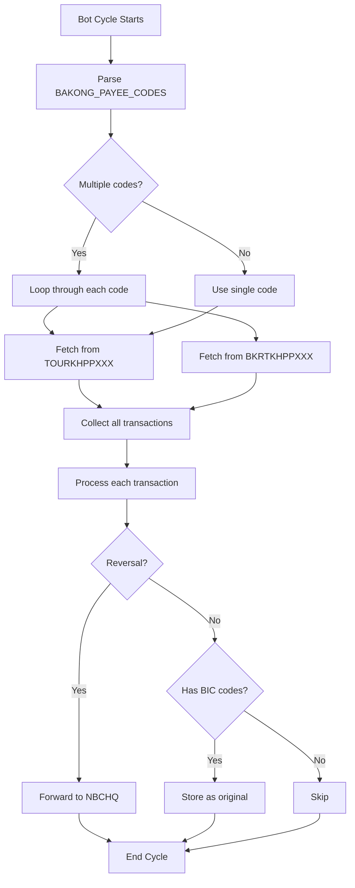

# Dual Monitoring Setup for Content-Based Pairing

## 🎯 Problem Solved

**Issue:** The bot was only monitoring `BAKONG_PAYEE_CODE=TOURKHPPXXX`, which means it only saw incoming transactions TO TOUR. This prevented content-based pairing from working because:

- Step 1: TOUR → BKRT (outgoing from TOUR) = **Bot doesn't see it** ❌
- Step 2: BKRT → TOUR (incoming to TOUR) = **Bot sees it** ✅

Result: The original transaction was never stored, so pairing couldn't happen.

## ✅ Solution

Implemented **dual account monitoring** - the bot now monitors incoming transactions for BOTH TOUR and BKRT accounts.

### What Changed

1. **Environment Configuration** - Now supports comma-separated payee codes
2. **BakongService** - Accepts optional payee code parameter
3. **ReversalService** - Loops through multiple payee codes and fetches from each
4. **Documentation** - Updated Scenario 2 and Migration Guide

## 🔧 Quick Setup

### 1. Update `.env.development`

```env
# OLD (single account monitoring)
BAKONG_PAYEE_CODE=TOURKHPPXXX

# NEW (dual account monitoring)
BAKONG_PAYEE_CODES=TOURKHPPXXX,BKRTKHPPXXX
```

### 2. Restart the bot

```bash
npm run dev
```

That's it! The bot will now monitor both accounts.

## 📊 How It Works Now

```
Bot Monitoring:
  ├─ TOURKHPPXXX (incoming transactions)
  │   └─ BKRT → TOUR ✅
  │
  └─ BKRTKHPPXXX (incoming transactions)
      └─ TOUR → BKRT ✅

Both directions visible = Content pairing works!
```

### Example Flow

**Cycle 1: Original Transaction**

```
📥 Fetching transactions for TOURKHPPXXX...
   ⏹️  No transaction data for TOURKHPPXXX

📥 Fetching transactions for BKRTKHPPXXX...
   ✅ Found 1 transaction(s) for BKRTKHPPXXX

Transaction: TOUR → BKRT (150,000 KHR)
📝 Stored original transaction for future pairing: CRTTOURKHPPXXX1738272000111
```

**Cycle 2: Reversal Transaction**

```
📥 Fetching transactions for TOURKHPPXXX...
   ✅ Found 1 transaction(s) for TOURKHPPXXX

📥 Fetching transactions for BKRTKHPPXXX...
   ⏹️  No transaction data for BKRTKHPPXXX

Transaction: BKRT → TOUR (150,000 KHR, NO "REVERSING" label)
🔗 CONTENT PAIRING: Transaction matched with original ID 123
   Original: TOURKHPPXXX → BKRTKHPPXXX
   Current:  BKRTKHPPXXX → TOURKHPPXXX
✅ REVERSAL DETECTED → Forward to NBCHQ
```

## 🎨 Visual Flow



## 🧪 Testing

### Test Scenario 2

```powershell
# Step 1: Send TOUR → BKRT (150,000 KHR)
Invoke-WebRequest -Uri "http://10.20.6.228/BakongWebService/NBCInterface" -Method POST -ContentType "text/xml; charset=utf-8" -InFile "test-scenarios/scenario2-content-pairing/scenario2-step1-original.xml"

# Wait 60+ seconds for bot to process and store as original

# Step 2: Send BKRT → TOUR (150,000 KHR, no "REVERSING" label)
Invoke-WebRequest -Uri "http://10.20.6.223/cb-adapter/BakongWebService/NBCInterface" -Method POST -ContentType "text/xml; charset=utf-8" -InFile "test-scenarios/scenario2-content-pairing/scenario2-step2-reversal-no-label.xml"

# Wait for bot to detect content pairing and forward to NBCHQ
```

### Expected Results

**After Step 1:**

- Bot sees transaction as incoming to BKRT
- Stores it as original for future pairing
- Database: 1 row with `is_reversal = false`

**After Step 2:**

- Bot sees transaction as incoming to TOUR
- Matches with stored original (swapped debtor/creditor)
- Forwards to NBCHQ
- Database: 2 rows, second row has `is_reversal = true` and `original_trx_id = <first row's id>`

## 🔍 Verification Queries

```sql
-- Check if dual monitoring is working
SELECT
  trx_hash,
  amount,
  debtor_bic,
  creditor_bic,
  is_reversal,
  original_trx_id,
  created_at
FROM transaction_logs
ORDER BY created_at DESC
LIMIT 10;

-- Verify pairing
SELECT
  r.trx_hash as reversal_hash,
  r.debtor_bic as reversal_from,
  r.creditor_bic as reversal_to,
  o.trx_hash as original_hash,
  o.debtor_bic as original_from,
  o.creditor_bic as original_to,
  r.amount
FROM transaction_logs r
LEFT JOIN transaction_logs o ON r.original_trx_id = o.id
WHERE r.is_reversal = true;
```

## 🎯 Key Benefits

1. **Sees Both Directions** - No transaction is missed
2. **True Content Pairing** - Works without labels or hardcoded directions
3. **Scalable** - Can add more accounts: `BAKONG_PAYEE_CODES=TOUR,BKRT,BANK3,BANK4`
4. **Backward Compatible** - Old `BAKONG_PAYEE_CODE` still works (fallback)

## 🔄 Backward Compatibility

The code supports both old and new configurations:

```typescript
// New style (recommended)
((BAKONG_PAYEE_CODES = TOURKHPPXXX), BKRTKHPPXXX);

// Old style (still works, but only monitors one account)
BAKONG_PAYEE_CODE = TOURKHPPXXX;

// Fallback if neither is set
// Defaults to: TOURKHPPXXX
```

## 🚀 Adding More Accounts

To monitor additional accounts, simply add them to the comma-separated list:

```env
BAKONG_PAYEE_CODES=TOURKHPPXXX,BKRTKHPPXXX,ABCDKHPPXXX,EFGHKHPPXXX
```

The bot will automatically fetch transactions from all listed accounts each cycle.

## 📞 Troubleshooting

### Issue: "No transactions found from any monitored account"

**Check:**

1. Is `BAKONG_PAYEE_CODES` set in `.env.development`?
2. Are both accounts spelled correctly?
3. Are there actually transactions in those accounts?

### Issue: Original not being stored

**Check:**

1. Is the transaction incoming to one of the monitored accounts?
2. Does the transaction have BIC codes? (Required for storage)
3. Check logs for "Stored original transaction" message

### Issue: Reversal not detected by pairing

**Check:**

1. Was the original stored first? (Check database)
2. Are amount and currency exactly the same?
3. Are debtor/creditor swapped correctly?
4. Check logs for "CONTENT PAIRING" message

---

**Version:** 2.1.0  
**Date:** 2026-01-30  
**Author:** Development Team
